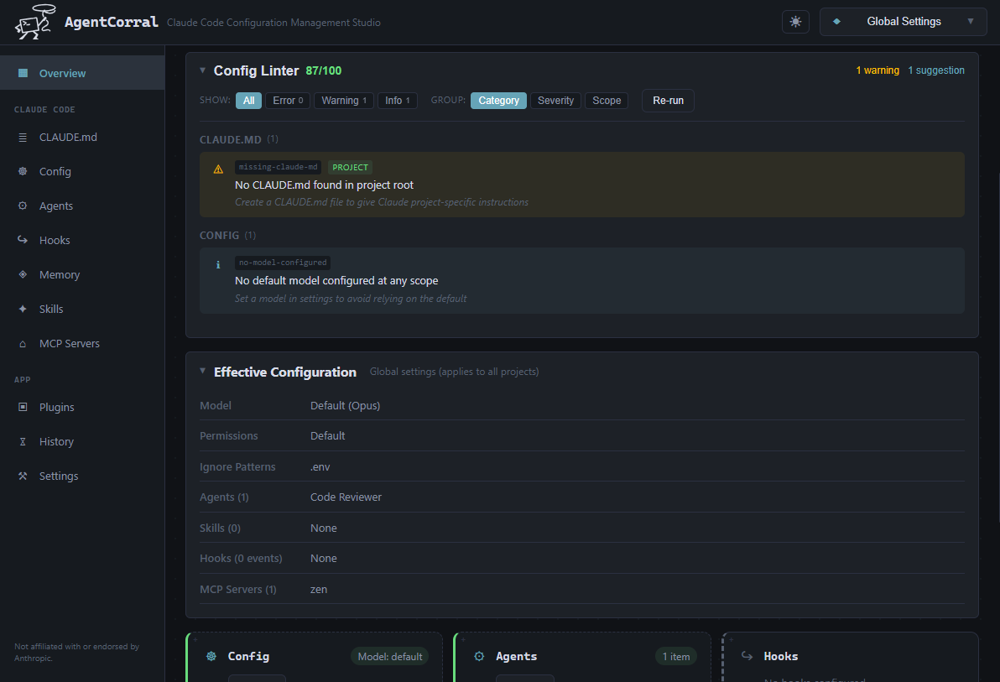
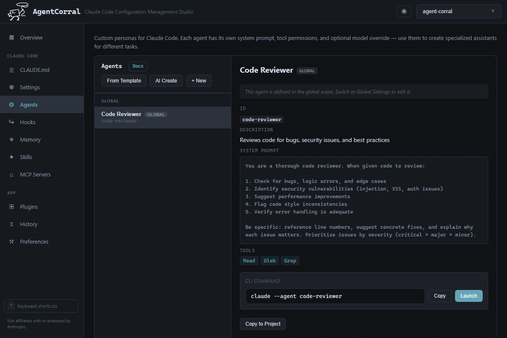
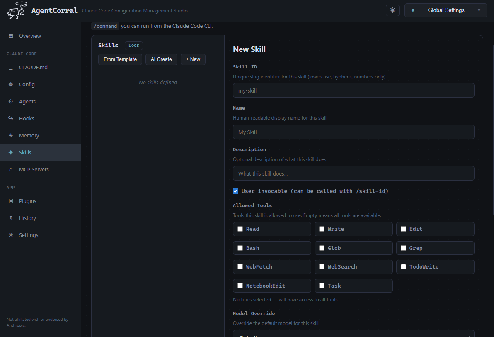
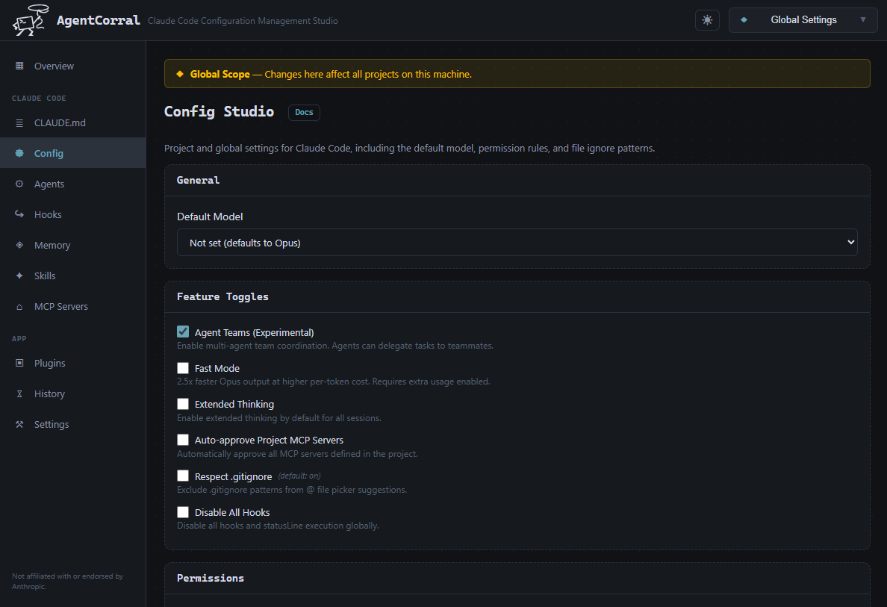

<p align="center">
  <picture>
    <source media="(prefers-color-scheme: dark)" srcset="assets/agent_corral_icon.png" />
    <source media="(prefers-color-scheme: light)" srcset="assets/agent_corral_icon_black.png" />
    
  </picture>
</p>

<h1 align="center">AgentCorral</h1>

<p align="center"><strong>Claude Code Configuration Management Studio</strong></p>

---

### Howdy, partner.

You've got Claude Code agents scattered across a dozen repos. Hooks defined in one project that you wish you had in another. MCP servers configured globally when they should be scoped to a project — or the other way around. Skills buried in directories you forgot existed. Memory stores you set up once and never touched again because, frankly, the JSON was a pain to wrangle by hand.

**That's the mess.** Claude Code is powerful, but its configuration lives in a tangle of dotfiles, JSON blobs, YAML frontmatter, and markdown spread across `~/.claude/` and every project's `.claude/` directory. There's no single place to see what you've got, no easy way to share setups between repos, and no guard rails when you're hand-editing config at 2am.

**AgentCorral rounds it all up.** This is your Claude Code configuration management studio — a desktop app that gives you a visual, unified interface to wrangle every piece of your Claude Code setup:

- **See everything at a glance** — One dashboard across all your repos. Know instantly which projects have agents, hooks, skills, MCP servers, and memory configured.
- **Stop copy-pasting JSON** — Visual editors for agents, hooks, skills, MCP servers, config, and memory. Built-in presets so you're not starting from scratch.
- **Global or project, your call** — Flip between global (`~/.claude/`) and project-scoped (`.claude/`) config with a single toggle. See exactly what applies where.
- **Share setups with your team** — Bundle agents, skills, hooks, and MCP servers into plugins. Export from one repo, import into another, install from git, and keep everyone in sync automatically.

No more digging through dotfiles. No more wondering which repo has that hook you wrote last month. No more breaking your config because you missed a comma in a JSON file.

**Saddle up. Your agents ain't gonna wrangle themselves.**

Built with [Tauri v2](https://v2.tauri.app/) + React (TypeScript) + Rust.

<p align="center">
  
</p>

---

## Features

- **Global + Project Scope** — Manage configuration at the global (`~/.claude/`) or project (`.claude/`) level. A scope toggle in the header switches between them, and an effective config view shows the merged result with source annotations.
- **Repo Registry** — Add and switch between repositories. The overview dashboard shows which repos have agents, hooks, skills, MCP servers, and memory configured.
- **Agent Studio** — Create, edit, and delete agents with a visual editor. Configure tools, model overrides, and memory bindings. Built-in presets for common roles (code reviewer, test writer, doc writer, refactorer). Launch agents directly from the app with `claude --agent <id>`.

  

- **Hooks Editor** — Manage hooks (PreToolUse, PostToolUse, Notification, Stop, SubagentStop) with built-in presets and drag & drop reordering for execution priority.
- **Skills Editor** — Create and manage skills with YAML frontmatter and markdown content.

  
- **MCP Servers** — Configure Model Context Protocol servers with health checks to verify availability.
- **Config Studio** — Edit Claude Code settings (model, permissions, ignore patterns) with a form UI. Snapshot configuration at any point and restore from history.

  
- **Memory Studio** — Manage memory stores and entries. Create/delete stores, add/edit/delete individual entries inline.
- **Plugin System** — Bundle agents, skills, hooks, and MCP servers into portable packages. Export from one repo, import into another, install from git, and auto-sync when the source changes.
- **Config Linter** — Comprehensive linting of your Claude Code configuration with 20+ rules. Detects hierarchy conflicts (CLAUDE.md contradictions, agent/skill/MCP shadowing, permission clashes, model overrides), validates references (dangling memory stores, nonexistent agents in skills), flags incomplete config (placeholder env vars, missing commands, empty prompts), and checks settings.json for unknown keys. Filterable by severity and groupable by category, severity, or scope.
- **Config Backup & Restore** — Export/import full configuration as a JSON bundle with merge or overwrite modes.
- **Create with AI** — Generate agents, skills, hooks, or MCP server configs from a natural-language description by launching Claude Code in a terminal.

## Getting Started

### Prerequisites

- [Node.js](https://nodejs.org/) v18+
- [Rust](https://www.rust-lang.org/tools/install) (stable toolchain) — after installing, restart your terminal so `cargo` is in your PATH
- Platform-specific Tauri v2 dependencies — see [Tauri prerequisites](https://v2.tauri.app/start/prerequisites/)

> **Note:** The first build will download and compile ~300 Rust crates, which can take several minutes. Subsequent builds are incremental and much faster.

### Install & Run

```bash
# Clone the repo
git clone https://github.com/llrowat/agent-corral.git
cd agent-corral

# Install frontend dependencies
npm install

# Run in development mode (starts Vite dev server + Tauri)
npm run tauri dev

# Build for production
npm run tauri build
```

## Project Structure

```
agent-corral/
├── backend/            # Rust backend (Tauri app)
│   ├── src/
│   │   ├── lib.rs              # App entry, state management
│   │   ├── main.rs             # Binary entry
│   │   ├── preferences.rs      # App preferences (plugin sync interval)
│   │   ├── commands/           # Tauri IPC command handlers (8 modules)
│   │   ├── repo_registry/      # SQLite repo management
│   │   ├── claude_adapter/     # Claude Code file format adapter (agents, hooks, skills, MCP, memory)
│   │   └── plugin_manager/     # Plugin export/import/git install/update, import sync registry
│   └── tauri.conf.json
├── frontend/           # React frontend
│   ├── components/     # Shared UI components (15+ components)
│   ├── pages/          # Page components (12 pages)
│   ├── hooks/          # React hooks (useRepos, usePluginSync, useKeyboardShortcuts, useSchema)
│   ├── lib/            # Tauri API bindings, built-in presets, JSON schemas
│   ├── types/          # TypeScript type definitions
│   └── styles.css      # Global styles (dark + light themes)
├── .github/workflows/  # CI (tests) + release (cross-platform builds)
├── Cargo.toml          # Workspace root
├── package.json        # Frontend dependencies
└── vite.config.ts      # Vite configuration
```

## Plugin System

Plugins use a directory-based format (`.claude-plugin/plugin.json`) bundling agents, skills, hooks, and MCP servers. They can be:

- **Exported** from any repo (choose which agents, skills, hooks, and MCP servers to include)
- **Imported** into any repo (preview changes before applying, choose add-only or overwrite mode)
- **Installed from Git** — point to any git repo containing a `.claude-plugin/` directory
- **Updated** — git-sourced plugins track their source commit and can be checked for updates
- **Auto-synced** — imported plugins can be tracked and automatically updated when the library version changes. Supports pinning (lock version) and auto-sync toggles per import.

## Releases

Pre-built executables are published as GitHub Releases. Each release includes installers for:

| Platform        | Artifact                        |
|-----------------|---------------------------------|
| Linux (x64)     | `.deb`, `.AppImage`             |
| macOS (Apple Silicon) | `.dmg`                    |
| macOS (Intel)   | `.dmg`                          |
| Windows (x64)   | `.msi`, `.exe` (NSIS installer) |

### Creating a release

Tag a commit and push the tag to trigger the release workflow:

```bash
git tag v0.1.0
git push origin v0.1.0
```

The [release workflow](.github/workflows/release.yml) builds on all platforms in parallel and creates a **draft** GitHub Release with the artifacts attached. Review the draft and publish it when ready.

You can also trigger a build manually from the **Actions** tab using the "Run workflow" button.

## Contributing

See [CONTRIBUTING.md](CONTRIBUTING.md) for development setup and guidelines.

## Disclaimer

AgentCorral is an independent, community-driven open source project. It is **not** affiliated with, endorsed by, or sponsored by Anthropic. "Claude" and "Claude Code" are trademarks of Anthropic. This project uses those names solely to describe the software it integrates with.

## License

[MIT](LICENSE)
